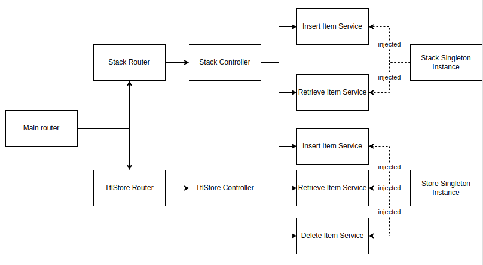

# TMG Test

To run the following project you will need to have NodeJS installed
I used the version 16.17.1

To run the projects you must install the dependencies, check if every test is passing and start it

```sh
$ npm install
$ npm test
$ npm start
```

To check all available routes, after you start the server.
If you reach: http://localhost:3000/api-docs
You will find a swagger documentation of the project, enabling you to try it out


## Project decisions

### Architecture

I made it in a layered architecture, so that each route group is divided into modules and each module is organized in horizontal layers.
The main layers are: route -> controllers -> services.
The following diagram illustrate the project structure:



The idea is that the controllers handle everything HTTP related, and the services purpose are to define the business rules implementation.

And besides that, there are the containers which register the stack and store as singletons to be injected on the services.

I used this container injection layout so that there is no need to build a factory to inject the dependencies. And also make the code more scalable in a way that if you want to change the stack or store implementation it could be done easily.

### Tests

I made mainly two kind of tests. Unit and integration. 
The unit tests are only for the services, to test if the business rules implementations are working the way they should.

The integration tests are simulating multiple HTTP request to assure that all the endpoints are working together following the test requisitions.

### Time to leave

There are several approaches on how to handle the ttl, in a real world application would be more suitable to go with a ElastiCache for example or even a dynamo, using their own implementation.

In this case, to manage the in-memory ttl I used the built-in setTimeout functions of NodeJS, letting the event-loop to handle the deletion of the key-values. Also needed to implement a way to remove those timeouts. So whenever a new item is inserted in the store, if it had a ttl, the service clears the timeout from the event-loop with the built-in clearTimeout function.

In a bigger application that uses redis for instance, it would be better to do a passive and active way of deleting the values with expired ttl.

Active way: Using a CRON job to pass through the database searching for expired values.

Passive way: Whenever a request to retrieve the value came, verify if the ttl has expired.

With this implementation the number of queries will be reduced, therefore the project would be more scalable.

Also, whenever a new item is inserted it would be necessary to do an upsert on the database, to make sure that there is only one value to a certain key.

### Validation

I used Joi for validation to manage each route that received a parameter, both in path or body.

Also took the liberty to set some boundaries such as:

Key must be a string with a max of 255 chars.
Ttl must be less than 60000 (60s).
Value must be a string or number.

Whenever the request pass this limits it will raise an error and a 400 status on the request.

### Exceptions

I created a base ApplicationError to be catched by the main server.

Every other exception must extend this class, so that whenever an error is raised it wouldn't brake the server.


